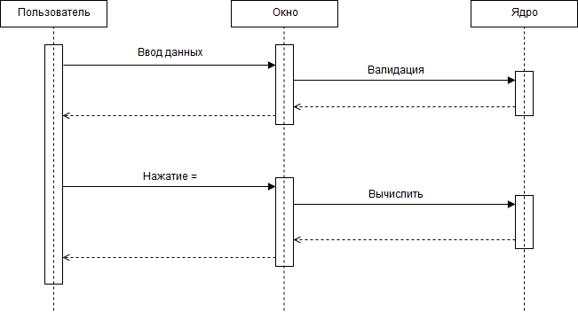
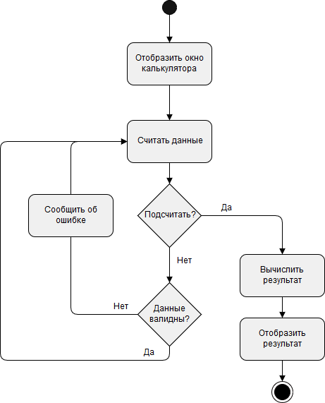
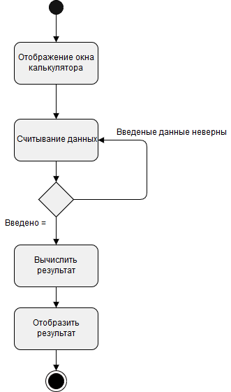
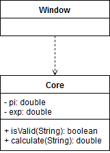
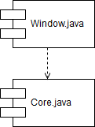
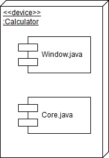

<h2>Содержание</h2>
    Моделирование динамического поведения системы
    1.1. Диаграммы последовательности
    1.2. Диаграммы активности
    1.3. Диаграмма состояний товара

    Моделирование статической структуры системы
    2.1. Диаграмма классов
    2.2. Диаграмма компонентов
    2.3. Диаграмма развёртывания

<h2>1. Моделирование динамического поведения системы</h2>
<h3>1.1. Диаграмма последовательности</h3>

<h3>1.2. Диаграмма активности</h3>

<h3>1.3. Диаграмма состояний</h3>

<h2>2. Моделирование статической структуры системы</h2>
<h3>2.1. Диаграмма классов</h3>

<h3>2.2. Диаграмма компонентов</h3>

<h3>2.3. Диаграмма развёртывания</h3>

