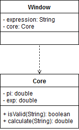

<h2>Содержание</h2>
    Моделирование динамического поведения системы 
    1.1. Диаграммы последовательности 
    1.2. Диаграммы активности 
    1.3. Диаграмма состояний товара 
    Моделирование статической структуры системы 
    2.1. Диаграмма классов 
    2.2. Диаграмма компонентов 
    2.3. Диаграмма развёртывания 

<h2>1. Моделирование динамического поведения системы</h2>
<h3>1.1. Диаграмма последовательности</h3>

<h3>1.2. Диаграмма активности</h3>

<h3>1.3. Диаграмма состояний</h3>

<h2>2. Моделирование статической структуры системы</h2>
<h3>2.1. Диаграмма классов</h3>

<h3>2.2. Диаграмма компонентов</h3>

<h3>2.3. Диаграмма развёртывания</h3>

